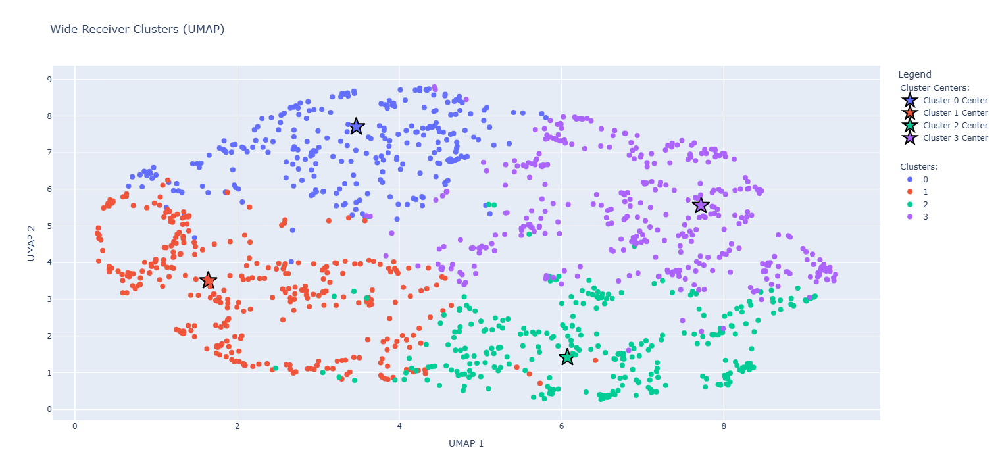
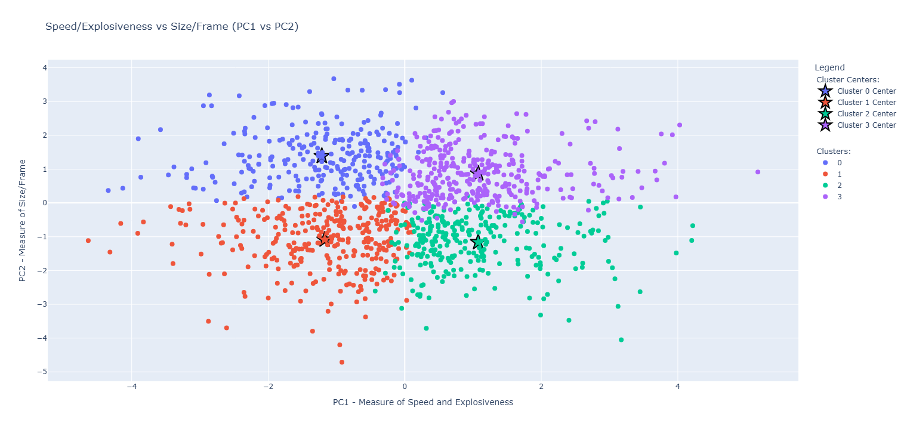

# nfl-wr-clustering
This project categorizes wide receivers into four different clusters based on NFL Combine data using PCA, and k-means, and then creates graphs to visualize
the clusters representing different types of receivers.

## What it does
- Gets combine data for wide receivers and cleans it
- Imputes missing values
- Applies PCA to reduce the feature space
- Clusters players with k-means
- Generates interactive HTML plots for the cluster results

## Requirements
- Python 3.10+
- Dependencies listed in pyproject.toml

## Outputs
The script writes results into the data directory, including:
- CSV files with cleaned/imputed data
- PCA rotation and explained variance files
- Interactive HTML plots for the cluster visualizations

**Click on the image below to see how all the wide receivers are categorized into clusters based off all 4 PC variables, and then reduced to 2D using UMAP.**

**Click on the image below to view the PC1 vs PC2 plot, which maps each wide receiver by PC1 (speed/explosiveness) and PC2(size/frame), and organizes them into clusters.**

## Notes
The pipeline is implemented in the main module under the nfl-wr-k-means-clustering package.
